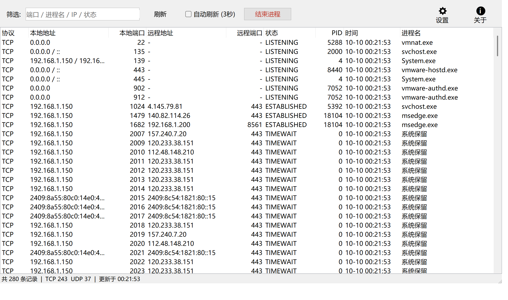
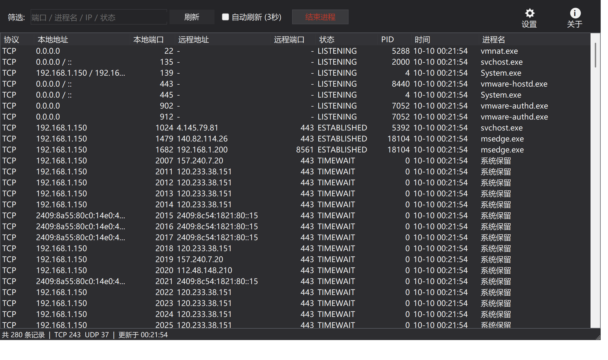
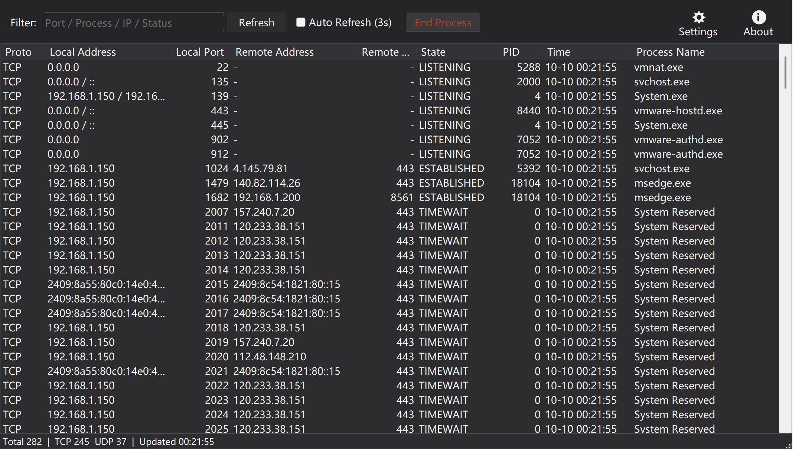
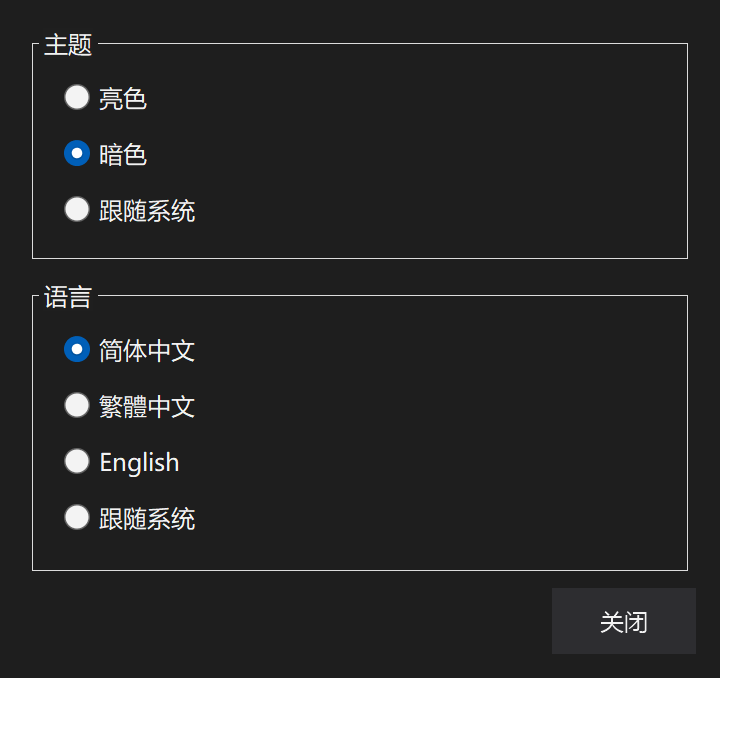
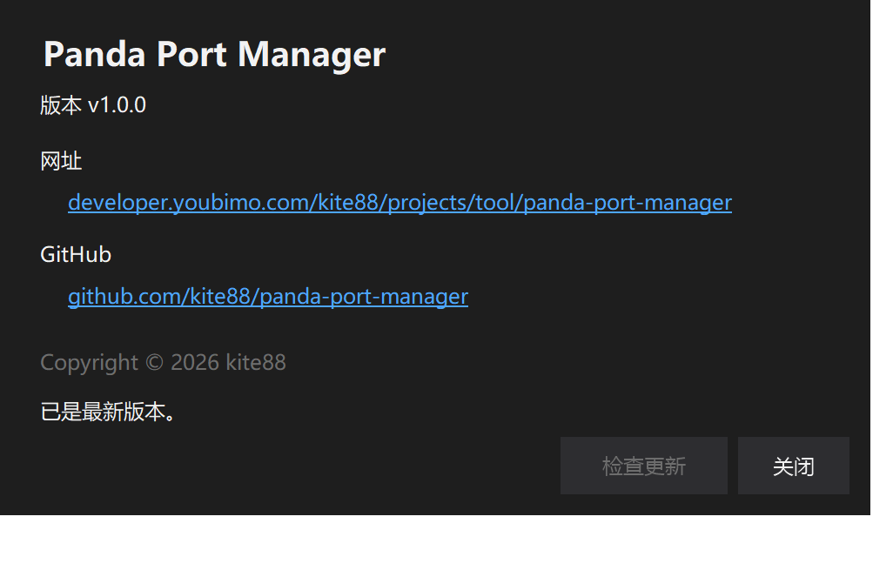

简体中文 | [English](README.en.md)

# Panda Port Manager · Windows 端口占用管理工具

[](https://github.com/kite88/panda-port-manager/releases/latest)
[](LICENSE)

一个 Windows 桌面小工具（WinForms / .NET 10），把「谁占了这个端口」这件事变成一眼可见：列出全部
TCP / UDP 端口占用及其进程，筛选、排序、一键结束进程释放端口；还能识别 winnat 系统保留端口
（Hyper-V / WSL / Docker 占用的「无主」端口）并一键释放。单文件 exe、开箱即用，支持中英双语与
亮暗主题。

## 截图

**亮色主题（简体中文）**



**暗色主题（简体中文）**



**暗色主题（English）**



**设置弹窗（暗色）**



**关于弹窗（版本号与官网 / GitHub 链接）**



## 功能特性

- **端口全景**：列出全部 TCP / UDP 端口占用，包含协议、本地地址 / 端口、远程地址 / 端口、
  连接状态、PID、进程名，以及「时间」列（该条目首次被发现的时间，用于观察新建连接）。
- **IPv4 / IPv6 双栈合并**：同一进程在同一端口上的 v4 与 v6 监听合并为一行，地址栏显示
  `0.0.0.0 / ::`，不再重复刷屏。
- **实时筛选**：按端口 / 进程名 / IP / 状态即时过滤，边输边筛。
- **排序**：点击任意列头排序，端口、PID 等数字列按数值比较（不会出现 10 排在 9 前面）。
- **结束进程**：支持单选、多选批量结束（含子进程树）；也可在列表上右键操作，或直接按
  `Delete` / `Enter`。系统关键进程受系统保护，结束失败会明确提示。
- **自动刷新**：默认手动，勾选后每 3 秒自动刷新；刷新会保持筛选结果、排序与选中行不变。
- **系统保留端口识别与释放**：对没有进程的端口，自动查询 `netsh` 的排除端口范围；若命中
  winnat 保留段（通常由 Hyper-V / WSL / Docker 保留），可一键重启 winnat 服务释放该范围。
- **主题**：亮色 / 暗色 / 跟随系统，暗色含标题栏（DWM）、列表表头、弹窗与右键菜单的完整适配。
- **三语界面**：简体中文 / 繁體中文 / English 即时切换，也可选「跟随系统」（繁体地区如台湾 / 香港 /
  澳门用繁體中文，其余中文用简体，非中文系统用 English）。
- **高 DPI 多屏适配**：基于 `PerMonitorV2` 并手工缩放，跨不同 DPI 的屏幕拖动时工具栏、按钮、列宽与
  字号按新 DPI 绝对重算（框架自身的缩放结果会被覆盖、绝不叠加），文字不会被裁切或忽大忽小。
- **设置 / 关于按钮**：工具栏右侧「设置」「关于」图标按钮（图标 + 文字）。设置打开弹窗切换
  主题与语言；关于弹窗显示版本号，并附
  [官网](https://developer.youbimo.com/projects/tool/panda-port-manager) 与
  [GitHub](https://github.com/kite88/panda-port-manager) 链接，点击即在浏览器打开。
- **设置持久化**：主题与语言保存在 `%LOCALAPPDATA%\PandaPortManager\settings.json`，即点即生效。

## 下载与运行

从 [Releases](https://github.com/kite88/panda-port-manager/releases/latest) 下载对应架构的包：

- `PandaPortManager-win-x64.zip`：64 位 Intel/AMD（最常见）
- `PandaPortManager-win-x86.zip`：32 位 x86
- `PandaPortManager-win-arm64.zip`：ARM64（如骁龙笔记本）

解压后得到 `PandaPortManager.exe`，双击运行即可。

- 系统要求：Windows 10 / 11，[.NET 10 Desktop Runtime](https://dotnet.microsoft.com/download/dotnet/10.0)。
- 程序清单声明了 `requireAdministrator`，启动时会弹出 UAC 提权确认——结束其他用户的进程、
  系统进程以及重启 winnat 都需要管理员权限。
- 卸载即删：程序是单文件，不写注册表，唯一的落盘数据是上面提到的 settings.json。

## 使用说明

1. **找端口**：在筛选框输入端口号（如 `8080`）、进程名、IP 或状态（如 `LISTENING`）。
2. **看进程**：「进程名」列即占用者；PID 为 0 且显示「系统保留」的条目没有对应进程。
3. **释放端口**：选中一行（或多行）后点红色「结束进程」按钮、右键选「结束进程」，或按
   `Delete` / `Enter`，确认后即结束进程并释放端口。
4. **释放保留端口**：对「系统保留」的端口点「结束进程」，若端口在 winnat 保留范围内会询问
   是否重启 winnat 服务（期间 WSL / Docker / NAT 网络可能短暂中断）。
5. **主题与语言**：点击右上角「设置」图标按钮打开设置弹窗，切换主题（亮色 / 暗色 / 跟随系统）
   与语言（简体中文 / 繁體中文 / English / 跟随系统），即点即生效并自动保存。

状态栏实时显示：记录总数、TCP / UDP 各多少条、最后更新时间。

## 从源码构建

需要 .NET 10 SDK（`net10.0-windows`）。

```powershell
# 编译
dotnet build PandaPortManager -c Release

# 发布单文件 exe（依赖目标机安装 .NET 10 Desktop Runtime）
dotnet publish PandaPortManager -c Release -r win-x64 `
  -p:PublishSingleFile=true -p:SelfContained=false -o dist
```

### 一键发布多架构（x64 / x86 / arm64）

仓库根目录的 `publish.ps1` 可一次性打出三套单文件包（依赖框架发布，需目标机已装
.NET 10 Desktop Runtime）；加 `-SelfContained` 则打包为自带运行时的绿色单文件：

```powershell
.\publish.ps1                 # 依赖框架
.\publish.ps1 -SelfContained   # 自带运行时（免装 .NET，体积更大）
```

产物分别位于 `publish/win-x64`、`publish/win-x86`、`publish/win-arm64`。

### 发版

推 `v*` 标签即可，workflow（`.github/workflows/release.yml`）会在 Windows runner 上自动编译、
发布单文件 exe、生成 SHA256 校验和并创建 GitHub Release：

```bash
git tag v1.0.0 && git push origin v1.0.0
```

标签名含 `-`（如 `v1.1.0-rc1`）会自动标记为 prerelease，不会顶掉 Latest。

## 实现要点

- **端口数据不靠解析 netstat 文本**：连接与监听列表来自 `IPGlobalProperties`
  （`GetActiveTcpListeners` / `GetActiveTcpConnections` / `GetActiveUdpListeners`），字段可靠；
  只有 PID 这一项该 API 拿不到，才退回解析一次 `netstat -ano`，按
  `协议|本地地址|本地端口|远程端口|状态` 把 PID 映射回条目。旧版 netstat 把 TIME_WAIT 输出成
  带空格的 `TIME WAIT`，解析时做了归一。
- **刷新不闪烁、不丢上下文**：刷新全程 `BeginUpdate/EndUpdate`，并记住筛选词、排序状态与选中行
  （按五元组 + 状态匹配恢复选中），「时间」列用首次发现时间而不是刷新时间，因此不会每次刷新被重置。
- **保留端口判定用系统口径**：直接解析 `netsh interface ipv4 show excludedportrange` 的输出区间，
  与系统「排除端口范围」完全一致，而不是硬编码常见段。
- **暗色不是简单换背景**：除了控件配色，还处理了 DWM 暗色标题栏（`DWMWA_USE_IMMERSIVE_DARK_MODE`）、
  自绘 ListView 暗色表头，以及 Professional 渲染器默认忽略 `ForeColor` 的右键菜单
  （自定义 Renderer 强制生效）。
- **工具栏图标是代码画的**：GDI+ 多边形齿轮与圆圈「i」+ 下方文字，不用任何图片资源。
- **设置读写容错**：settings.json 解析失败时静默回退默认值（跟随系统主题 / 跟随系统语言），不会崩溃。

## 已知局限

1. 仅 Windows（WinForms），且 `requireAdministrator` 使每次启动都有一次 UAC 确认；只看不杀的
   场景其实不需要管理员权限。
2. 结束进程是对 PID 的强杀（`Kill(entireProcessTree: true)`），没有「仅断开连接」或优雅关闭选项。
3. 刷新通过 `netstat -ano` 子进程拿 PID，机器上连接数极多时该步骤耗时随之增长（已限制 5 秒超时）。

## 目录结构

```text
panda-port-manager/
├── .github/workflows/release.yml   # 推 v* 标签自动发版
├── images/                         # README 截图
├── PandaPortManager/
│   ├── PandaPortManager.csproj     # net10.0-windows / WinForms / 单文件发布
│   ├── Program.cs                  # 入口
│   ├── Localization.cs             # Language 枚举 + R 文案表（简/繁/英）
│   ├── ListViewExtensions.cs       # ListViewItem.SubCells()（整行文本拼接）
│   ├── Forms/
│   │   ├── MainForm.cs             # 主窗体骨架：控件字段、构造、Load
│   │   ├── MainForm.Layout.cs      # DPI 缩放与工具栏/筛选框布局
│   │   ├── MainForm.Theme.cs       # 明暗调色板、DWM 暗色标题栏、表头自绘
│   │   ├── MainForm.Controls.cs    # 自绘按钮、工具栏图标、双缓冲列表、排序器
│   │   ├── MainForm.Ports.cs       # 端口扫描、netstat PID 映射、筛选
│   │   ├── MainForm.Actions.cs     # 结束进程、winnat 保留端口释放、列排序
│   │   ├── MainForm.Dialogs.cs     # 设置 / 关于弹窗
│   │   ├── MainForm.Updates.cs     # GitHub Releases 更新检测
│   │   └── MainForm.Settings.cs    # 设置持久化、主题/语言切换
│   └── app.manifest                # requireAdministrator（启动时 UAC 提权）
├── PandaPortManager.slnx
└── LICENSE                         # MIT
```

> `MainForm` 用 `partial class` 按职责拆分：文件之间共享同一份私有字段（控件、主题色、
> DPI 基准值），没有为了拆文件而引入额外的抽象层或改变任何界面行为。

## 许可证

[MIT](LICENSE)
